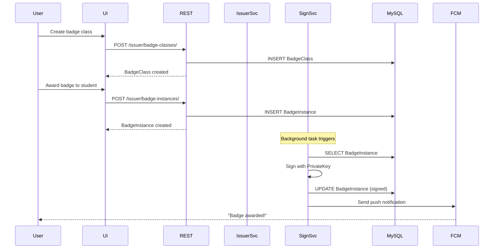
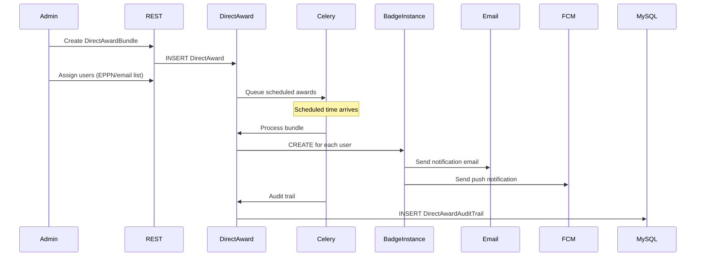
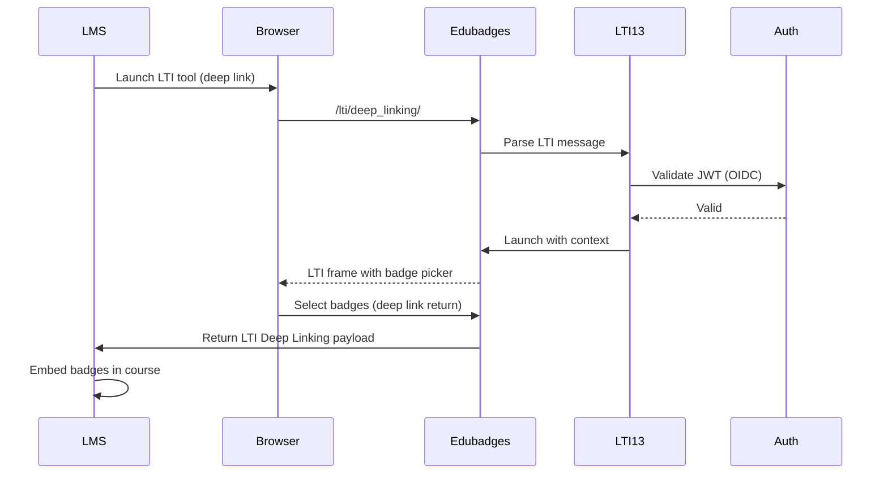
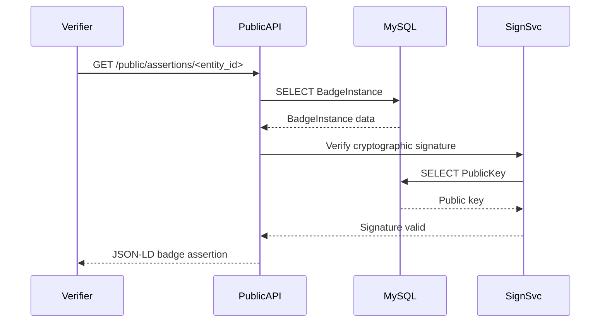
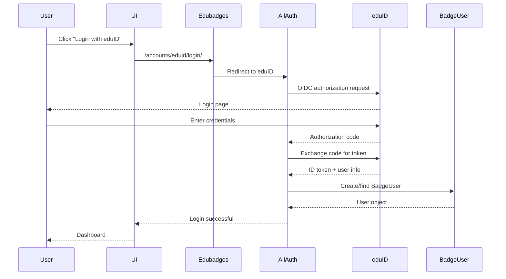
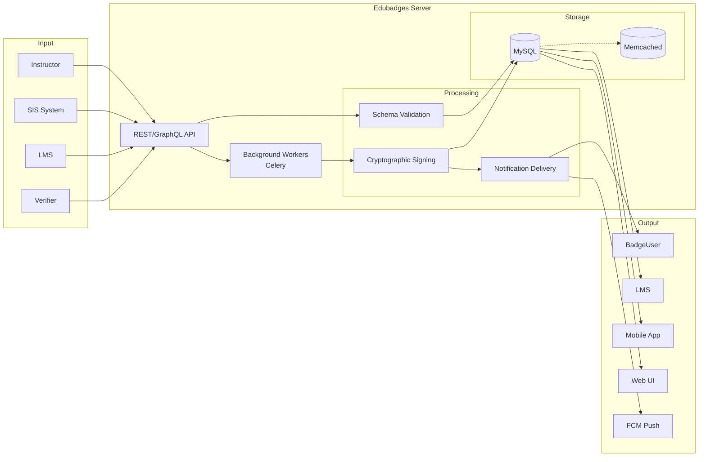
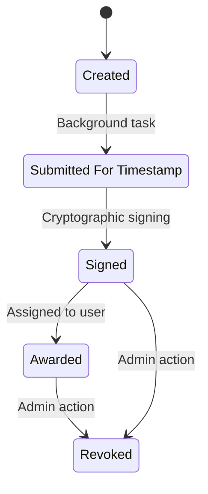
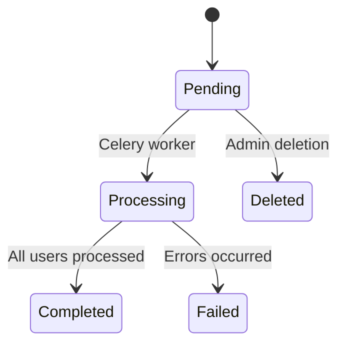

# Workflow Overview

## Core Workflows

### Workflow 1: Badge Creation and Issuance

This is the primary user journey: an instructor creates a badge class and awards it to students.

**Steps**:
1. Instructor creates a `BadgeClass` with name, description, criteria, and image
2. BadgeClass is validated against Open Badges schema
3. Instructor awards `BadgeInstance` (assertion) to a `BadgeUser`
4. Background task submits instance for cryptographic timestamping
5. `SigningService` signs the assertion with institutional private key
6. Timestamp proof is optionally anchored to BTC ledger
7. User receives push notification via Firebase Cloud Messaging
8. Badge is available in the user's backpack and publicly verifiable

### Workflow 2: Direct Award (Bulk Issuance)

Bulk badge issuance for SIS integration or class-wide awards.

**Steps**:
1. Administrator creates a `DirectAwardBundle` referencing a `BadgeClass`
2. Users are identified by EPPN (eduID) or email address
3. Bundle is scheduled for future processing (or immediate)
4. Celery worker processes the bundle at scheduled time
5. `BadgeInstance` records are created for each matching user
6. Audit trail is recorded for compliance
7. Affected users receive email and push notifications

### Workflow 3: LTI 1.3 Integration

Learning Management System integration for launching Edubadges as an LTI tool.

**Steps**:
1. Instructor launches Edubadges from within an LMS (Canvas, Moodle) via LTI 1.3
2. OIDC authentication validates the LTI message
3. Edubadges presents badge picker within LMS iframe
4. Instructor selects badges to embed in course
5. Edubadges returns Deep Linking payload to LMS
6. LMS embeds selected badges in course content

### Workflow 4: Badge Verification (Public JSON-LD)

Third-party verification of badge assertions via the public API.

**Steps**:
1. Third-party verifier requests badge assertion via public JSON-LD endpoint
2. Server retrieves `BadgeInstance` and serializes to JSON-LD per Open Badges spec
3. Cryptographic signature is verified using the associated public key
4. JSON-LD response includes all required Open Badges fields
5. Verifier validates the `@context`, `@id`, and cryptographic proof

### Workflow 5: Social Authentication (eduID/SURFConext)

Multi-provider SSO for Dutch higher education users.

**Steps**:
1. User clicks SSO provider button (eduID or SURFConext)
2. Django Allauth redirects to provider's OIDC endpoint
3. User authenticates with institutional credentials
4. Authorization code is exchanged for ID token
5. User info is extracted (EPPN, schacHomeOrganization, etc.)
6. `BadgeUser` is created or looked up by email
7. User is logged in and redirected to the application

## Data Flow

## State Management

### BadgeInstance (Assertion) States

### DirectAward States

## Authentication Methods

| Method | Usage | Scope |
|--------|-------|-------|
| **MobileAPIAuthentication** | Mobile app endpoints | App-specific tokens |
| **OIDCAuthentication** | LTI 1.3, SSO providers | OIDC ID tokens |
| **BadgrOAuth2Authentication** | REST API consumers | OAuth2 access/refresh tokens |
| **ExplicitCSRFSessionAuthentication** | Web UI (Django admin) | Session cookies |

### OAuth2 Scopes

| Scope | Permissions |
|-------|-------------|
| `r:profile` | Read user profile |
| `rw:profile` | Read/write user profile |
| `r:backpack` | Read user badge collection |
| `rw:backpack` | Read/write user badge collection |
| `rw:issuer` | Full issuer access (all institutions) |
| `rw:issuer:*` | Full issuer access (specific institution) |
| `r:assertions` | Read badge assertions |

## Error Handling

### Application-Level
- `ExceptionHandlerMiddleware` catches unhandled exceptions and returns structured JSON errors
- Custom 404/500 handlers for consistent error pages
- Django debug toolbar in development (`DEBUG=True`)

### API-Level
- DRF exception handlers for validation errors (400), authentication failures (401), permission denied (403)
- Prometheus metrics via `django-prometheus` for monitoring error rates
- Structured JSON logging via `loki-logger-handler` for Loki/ELK integration

### Background Task-Level
- Celery retries with exponential backoff for transient failures
- `DirectAwardAuditTrail` records success/failure per user
- Failed timestamping tasks are logged for manual review

## Security Considerations

- **Cryptographic Signing**: Private keys stored in database, used for assertion signing
- **CSRF Protection**: Session-based authentication with explicit CSRF middleware
- **2FA Support**: TOTP-based two-factor authentication for admin users
- **Protected Media**: Badge assertion files served through protected document view
- **CORS**: Configurable per-environment (default permissive for development)
- **Environment Secrets**: All sensitive configuration via environment variables
