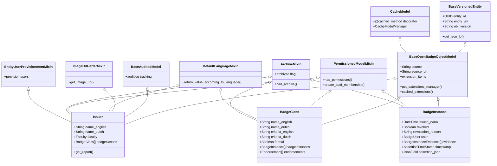

# Deep Dive: Badge Domain (issuer app)

## Overview

The `issuer` app is the **core domain model** of the Edubadges platform. It contains the primary entities for the Open Badges ecosystem: `Issuer`, `BadgeClass`, and `BadgeInstance` (assertion). This app handles badge creation, issuance, evidence tracking, alignment mapping, extensions, and collections.

## Responsibilities

- **Issuer Management**: Create, update, archive educational organizations that issue badges
- **BadgeClass Management**: Define badge criteria, description, image, and issuance rules
- **BadgeInstance Lifecycle**: Create assertions, track evidence, manage signing state
- **Evidence Tracking**: Link badge instances to supporting evidence (URLs, files)
- **Alignment Mapping**: Map badges to standards, frameworks, and learning objectives
- **Extensions System**: Support Open Badges extensions (custom fields)
- **JSON-LD Serialization**: Serialize badge entities to Open Badges-compliant JSON-LD

## Architecture

### Inheritance Hierarchy



### Key Relationships

```mermaid
erDiagram
    Issuer ||--o{ Faculty : belongs_to (faculty FK)
    Issuer ||--o{ BadgeClass : has_many
    Issuer }o--o{ BadgeUser : staff (via IssuerStaff)
    
    BadgeClass ||--o{ Issuer : belongs_to (issuer FK)
    BadgeClass ||--o{ BadgeInstance : has_many
    BadgeClass ||--o{ BadgeClassStaff : has_many
    BadgeClass ||--o{ Endorsement : as_endorser
    BadgeClass ||--o{ Endorsement : as_endorsee
    BadgeClass ||--o{ BadgeClassTag : many_to_many
    BadgeClass ||--o{ StudentsEnrolled : lti_students
    BadgeClass ||--|| LtiCourse : one_to_one
    
    BadgeInstance ||--|| BadgeClass : belongs_to
    BadgeInstance ||--|| Issuer : belongs_to
    BadgeInstance ||--o| BadgeUser : belongs_to (nullable)
    BadgeInstance ||--o| PublicKeyIssuer : signed_by
    BadgeInstance ||--o| DirectAwardBundle : awarded_by
    BadgeInstance ||--o{ BadgeInstanceEvidence : has_many
    BadgeInstance ||--o| BadgeInstanceCollection : in_collection
    
    BadgeInstanceEvidence }o--|| BadgeInstance : evidence_for
```

## Key Files

| File | Purpose |
|------|---------|
| `models.py` | All domain models: Issuer, BadgeClass, BadgeInstance, Evidence, Alignment, Extensions |
| `serializers.py` | DRF serializers for API serialization/validation |
| `api_urls.py` | REST API URL routing for v1 and v2 |
| `schema.py` | GraphQL schema definitions |
| `views.py` | Custom view classes and helpers |
| `managers.py` | Custom QuerySets: BadgeInstanceManager, IssuerManager, BadgeClassManager |
| `utils.py` | Badge serialization helpers, OBI versioning, JSON-LD context |

## Implementation Details

### Issuer Model

Represents an educational organization that issues badges.

```python
class Issuer(
    EntityUserProvisionmentMixin, ArchiveMixin, PermissionedModelMixin,
    ImageUrlGetterMixin, BaseAuditedModel, DefaultLanguageMixin,
    BaseVersionedEntity, BaseOpenBadgeObjectModel,
):
    # Bilingual fields
    name_english = models.CharField(max_length=512)
    name_dutch = models.CharField(max_length=512)
    description_english = models.TextField()
    description_dutch = models.TextField()
    
    # Organization hierarchy
    faculty = models.ForeignKey('institution.Faculty', on_delete=models.CASCADE)
    
    # Staff and permissions
    staff = models.ManyToManyField('badgeuser.BadgeUser', through='staff.IssuerStaff')
    
    # Image and contact
    image_english = models.FileField(upload_to='uploads/issuers')
    image_dutch = models.FileField(upload_to='uploads/issuers')
    email = models.CharField(max_length=254)
```

Key behaviors:
- **Bilingual fallback**: `name` property returns English or Dutch based on language context
- **Image inheritance**: Falls back to faculty image, then institution image
- **Unique validation**: Prevents duplicate names within same faculty
- **Archival**: Can be archived if no active badge instances reference it
- **Reporting**: `get_report()` aggregates assertion counts by type

### BadgeClass Model

Defines a badge type — the "template" for assertions.

```python
class BadgeClass(
    EntityUserProvisionmentMixin, PermissionedModelMixin,
    ImageUrlGetterMixin, DefaultLanguageMixin,
    BaseVersionedEntity, BaseOpenBadgeObjectModel,
):
    issuer = models.ForeignKey(Issuer, on_delete=models.CASCADE)
    name_english = models.CharField(max_length=512)
    name_dutch = models.CharField(max_length=512)
    description_english = models.TextField()
    description_dutch = models.TextField()
    criteria_english = models.TextField()  # Requirements to earn
    criteria_dutch = models.TextField()
    image = models.ImageField(upload_to='uploads/badgeclass')
    formal = models.BooleanField(default=False)  # formal vs informal credential
    tags = models.ManyToManyField('institution.BadgeClassTag')
    award_allowed_institutions = models.ManyToManyField('institution.Institution')
```

Key behaviors:
- **Formal vs Informal**: Tracks whether a badge is part of a formal curriculum
- **Criteria**: Stores requirements as human-readable text (Open Badges criteria field)
- **Institution restrictions**: Optional list of institutions allowed to award this badge
- **Tagging**: Categorical tags for classification and filtering
- **Assertions count**: Cached count of issued instances

### BadgeInstance Model (Assertion)

Represents a single awarded badge to a specific user.

```python
class BadgeInstance(
    PermissionedModelMixin, ArchiveMixin,
    DefaultLanguageMixin, BaseVersionedEntity,
    BaseOpenBadgeObjectModel,
):
    badgeclass = models.ForeignKey(BadgeClass, on_delete=models.PROTECT)
    issuer = models.ForeignKey(Issuer, on_delete=models.PROTECT)
    user = models.ForeignKey('badgeuser.BadgeUser', on_delete=models.CASCADE, null=True)
    issued_nano = models.BigIntegerField()  # Nanosecond-precision timestamp
    revoked = models.BooleanField(default=False)
    revocation_reason = models.CharField(max_length=1024, blank=True)
    public_key_issuer = models.ForeignKey(PublicKeyIssuer, on_delete=models.PROTECT)
    direct_award_bundle = models.ForeignKey(DirectAwardBundle, on_delete=models.PROTECT, null=True)
    assertion_json = JSONField(default=dict)  # Signed assertion payload
```

Key behaviors:
- **Nanosecond precision**: `issued_nano` stores nanosecond-precision timestamps per Open Badges spec
- **Revocation**: Supports revocation with optional reason (visible in JSON-LD)
- **Cryptographic signing**: Each assertion is signed with a `PublicKeyIssuer` key
- **Evidence**: Linked `BadgeInstanceEvidence` records for supporting materials
- **Direct award tracking**: Links to `DirectAwardBundle` if awarded via bulk process
- **Assertion JSON**: Contains the full signed assertion payload

### BadgeInstanceEvidence

Supporting evidence for a badge assertion.

```python
class BadgeInstanceEvidence(models.Model):
    badgeinstance = models.ForeignKey(BadgeInstance, on_delete=models.CASCADE)
    asset = models.FileField(upload_to='uploads/evidence')
    assertion = JSONField()  # Evidence assertion in JSON-LD format
```

### BadgeClassAlignment

Maps badges to external standards and frameworks.

```python
class BadgeClassAlignment(models.Model):
    badgeclass = models.ForeignKey(BadgeClass, on_delete=models.CASCADE)
    target_name = models.CharField(max_length=512)  # e.g., "Common Core Standard"
    target_desc = models.TextField()  # Description of the standard
    target_url = models.URLField()  # URL to the standard/framework
    framework = models.CharField(max_length=512)  # e.g., "http://purl.org/NET/obi#"
```

### Extension System

Open Badges extensions are stored as separate rows in extension tables.

```python
class BadgeClassExtension(CacheModel):
    name = models.CharField(max_length=254)
    original_json = models.TextField()
    badgeclass = models.ForeignKey(BadgeClass, related_name='extensions')

class BadgeInstanceExtension(CacheModel):
    name = models.CharField(max_length=254)
    original_json = models.TextField()
    badgeinstance = models.ForeignKey(BadgeInstance, related_name='extensions')
```

Extensions are managed via the `extension_items` property:
```python
badgeclass.extension_items = {
    'alignment': {'targetName': 'Math Standard', 'targetUrl': '...'},
    'multiplier': 2,
}
```

## Dependencies

- **Internal**: `entity`, `basic_models`, `cachemodel`, `signing`, `staff`, `institution`, `directaward`, `endorsement`, `badgeuser`, `lti_edu`, `lti13`
- **External**: django-auditlog, jsonfield, Pillow, PyLD

## API Interface

### REST Endpoints (`/issuer/`)

| Endpoint | Method | Description |
|-----------|--------|-------------|
| `/issuer/issuers/` | GET/POST | List/create issuers |
| `/issuer/issuers/{entity_id}/` | GET/PUT/DELETE | Get/update/delete issuer |
| `/issuer/badge-classes/` | GET/POST | List/create badge classes |
| `/issuer/badge-classes/{entity_id}/` | GET/PUT/DELETE | Get/update/delete badge class |
| `/issuer/badge-instances/` | GET/POST | List/create assertions |
| `/issuer/badge-instances/{entity_id}/` | GET/PUT/DELETE | Get/update/delete assertion |
| `/issuer/badge-instances/{entity_id}/evidence/` | GET/POST | List/add evidence |
| `/issuer/badge-classes/{entity_id}/assertions-count/` | GET | Assertion count |

### GraphQL Types

```graphql
type Issuer {
  entity_id: ID!
  name_english: String
  name_dutch: String
  faculty: Faculty!
  badgeclasses: [BadgeClass!]!
  staff: [BadgeUser!]!
  cached_badgeclasses_count: Int!
}

type BadgeClass {
  entity_id: ID!
  name_english: String
  issuer: Issuer!
  badgeinstances: [BadgeInstance!]!
  endorsements: [Endorsement!]!
  tags: [BadgeClassTag!]!
  formal: Boolean!
}

type BadgeInstance {
  entity_id: ID!
  badgeclass: BadgeClass!
  user: BadgeUser
  issued_nano: BigInt!
  revoked: Boolean!
  evidence: [BadgeInstanceEvidence!]!
  timestamp: AssertionTimeStamp
}
```

## Testing

- Management command `verify_get_json` validates JSON-LD output
- Management command `fix_badgeclass_images` repairs corrupted image references
- DRF serializer validation enforces Open Badges schema compliance
- Integration tests cover badge lifecycle from creation to signing

## Potential Improvements

1. **BadgeInstance state machine**: Current state tracking is implicit (signed, revoked). A proper state machine would make transitions explicit and auditable.

2. **BadgeClass versioning**: BadgeClass supports OBI versioning at the entity level, but changes to criteria/description are not versioned. Consider a `BadgeClassVersion` model for audit trails.

3. **Evidence file storage**: Currently stored in local `uploads/evidence`. Consider S3-compatible storage for production deployments.

4. **Async evidence upload**: Large evidence files are uploaded synchronously. Consider chunked uploads with background processing.

5. **BadgeClass templates**: No built-in template system for creating similar badge classes. Could benefit from a clone/template feature.

6. **Bulk badge export**: No built-in export of badge data to CSV/JSON. Useful for institutional reporting.
