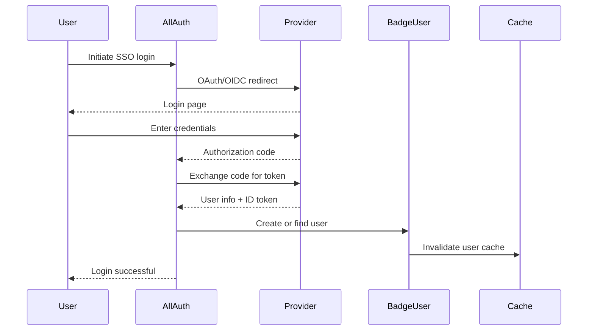

# Deep Dive: User Model & Authentication (badgeuser + badgrsocialauth)

## Overview

The user system centers on the custom `BadgeUser` model and provides multi-provider authentication through Django Allauth. The system supports institutional SSO (eduID, SURFConext) for Dutch higher education, plus standard OAuth2 providers.

## Responsibilities

- **Custom User Model**: `BadgeUser` replaces Django's default User with badge-specific fields
- **Social Authentication**: eduID, SURFConext, Facebook, Azure, LinkedIn via Allauth
- **Terms Management**: Track user agreements to terms and conditions
- **Email Management**: Multi-email support with validation
- **Affiliation Tracking**: Student affiliations with schacHomeOrganization and EPPN
- **2FA Support**: TOTP-based two-factor authentication via django-otp
- **Profile Management**: User profile CRUD and preferences

## Architecture

### BadgeUser Model

```python
class BadgeUser(AbstractBaseUser, PermissionsMixin, ModelsBaseModel):
    """Custom user model replacing Django's default User."""
    
    # Core fields
    email = models.EmailField(unique=False)  # Emails are not unique (can have multiple)
    username = models.CharField(max_length=255, unique=True)
    is_active = models.BooleanField(default=True)
    is_teacher = models.BooleanField(default=False)
    validated_name = models.CharField(max_length=255, blank=True)
    
    # Institutional affiliation
    institution = models.ForeignKey('institution.Institution', on_delete=models.SET_NULL, null=True, blank=True)
    
    # SSO fields
    schac_home_organization = models.CharField(max_length=255, blank=True)
    external_id = models.CharField(max_length=255, blank=True)  # SSO provider user ID
    
    # Terms and agreements
    terms_agreements = models.ManyToManyField('Terms', through='TermsAgreement')
    
    # Staff memberships (M2M through)
    institution_staff = models.ManyToManyField('institution.Institution', through='InstitutionStaff')
    issuer_staff = models.ManyToManyField('issuer.Issuer', through='IssuerStaff')
    badgeclass_staff = models.ManyToManyField('issuer.BadgeClass', through='BadgeClassStaff')
    
    # Affiliations
    affiliations = models.ManyToManyField('StudentAffiliation', through='BadgeUserAffiliation')
    
    # Auth
    objects = BadgeUserManager()
    
    USERNAME_FIELD = 'username'
    REQUIRED_FIELDS = ['email']
```

### Key Relationships

```mermaid
erDiagram
    BadgeUser ||--o{ EmailAddress : has_many (via allauth)
    BadgeUser ||--o{ TermsAgreement : agrees_to
    BadgeUser ||--o{ InstitutionStaff : staff_of
    BadgeUser ||--o{ IssuerStaff : staff_of
    BadgeUser ||--o{ BadgeClassStaff : staff_of
    BadgeUser ||--o{ StudentAffiliation : affiliated_with
    BadgeUser ||--o{ BadgeInstance : earns
    BadgeUser ||--o{ ImportedAssertion : imports
    BadgeUser ||--o{ DirectAward : receives
    
    EmailAddress }o--|| BadgeUser : belongs_to
    TermsAgreement }o--|| Terms : references
    StudentAffiliation }o--|| BadgeUser : belongs_to
    StudentAffiliation ||--|| BadgeUser : user_ref
```

### Social Authentication Flow



## Key Files

| File | Purpose |
|------|---------|
| `badgeuser/models.py` | BadgeUser model, StudentAffiliation, Terms/TermsAgreement |
| `badgeuser/forms.py` | BadgeUserCreationForm, signup forms |
| `badgeuser/backends.py` | CachedModelBackend for authentication |
| `badgeuser/managers.py` | BadgeUserManager with custom query methods |
| `badgrsocialauth/adapter.py` | BadgrSocialAccountAdapter for signup behavior |
| `badgrsocialauth/views.py` | Social auth views and redirects |
| `badgrsocialauth/serializers.py` | DRF serializers for auth endpoints |

### Social Auth Providers

| Provider | Type | Configuration |
|----------|------|---------------|
| **eduID** | OpenID Connect | `EDUID_PROVIDER_URL`, `EDU_ID_CLIENT`, `EDU_ID_SECRET` |
| **SURFConext** | OpenID Connect | `SURF_CONEXT_CLIENT`, `SURF_CONEXT_SECRET` |
| **Facebook** | OAuth2 | Facebook App credentials |
| **Azure** | OpenID Connect | Azure AD App registration |
| **LinkedIn** | OAuth2 | LinkedIn App credentials |

## Implementation Details

### CachedUserManager

The `BadgeUserManager` uses custom query methods optimized for the caching layer:

```python
class BadgeUserManager(models.Manager):
    def get_by_email(self, email):
        """Find user by email, using cache when available."""
        # Uses @cached_property on BadgeUser for email lookups
        
    def get_or_create_from_social(self, social_user, is_new):
        """Create or update user from social auth data."""
        # Extracts email, name, schac_home_organization from provider
        # Creates StudentAffiliation records if present
```

### Terms Management

```python
class Terms(models.Model):
    """Pre-configured terms and conditions."""
    name = models.CharField(max_length=255)
    text = models.TextField()
    active = models.BooleanField(default=True)

class TermsAgreement(models.Model):
    """Tracks which users agreed to which terms."""
    user = models.ForeignKey(BadgeUser, on_delete=models.CASCADE)
    terms = models.ForeignKey(Terms, on_delete=models.CASCADE)
    agreed_date = models.DateTimeField(auto_now_add=True)
```

### Student Affiliations

Tracks institutional affiliations for LTI and eduID integration:

```python
class StudentAffiliation(models.Model):
    user = models.ForeignKey(BadgeUser, on_delete=models.CASCADE)
    schac_home = models.CharField(max_length=255)  # e.g., "nl.surf.nl"
    eppn = models.CharField(max_length=255)  # Educational Personal Permanent Name
```

### Email Management

Uses Django Allauth's `EmailAddress` model for multi-email support:

```python
# BadgeUser cached method
@cached_method
def cached_emails(self):
    return list(self.emailaddress_set.filter(primary=True))
```

## Dependencies

- **Internal**: `institution`, `issuer`, `staff`, `backpack`, `directaward`
- **External**: django-allauth, social-auth-app-django, django-otp, django-autoslug

## API Interface

### User Endpoints (`/user/`)

| Endpoint | Method | Description |
|-----------|--------|-------------|
| `/user/profile/` | GET/PUT | Get/update user profile |
| `/user/register/` | POST | Register new user |
| `/user/terms/` | GET/POST | List/accept terms |
| `/user/emails/` | GET/POST | Manage email addresses |
| `/user/affiliations/` | GET/POST | Manage institutional affiliations |

### GraphQL Types

```graphql
type BadgeUser {
  entity_id: ID!
  username: String!
  email: String
  is_teacher: Boolean!
  institution: Institution
  affiliations: [StudentAffiliation!]!
  badgeinstances: [BadgeInstance!]!
  terms_agreements: [TermsAgreement!]!
  cached_badgeinstances_count: Int!
}

type StudentAffiliation {
  entity_id: ID!
  schac_home: String!
  eppn: String!
}
```

## Testing

- `BadgeUserCreationForm` validates email format and uniqueness
- Social auth integration tests verify provider callbacks
- Terms agreement tracking tests verify acceptance workflow

## Potential Improvements

1. **Email uniqueness constraint**: Currently `email` is not unique (users can have multiple email addresses). Consider making primary email unique for simpler lookups.

2. **Soft delete for users**: Currently BadgeUser uses hard deletes. A `is_deleted` flag with data archival would support GDPR right-to-erasure.

3. **User activity logging**: No built-in activity log for user actions. Could benefit from integration with django-auditlog at the user level.

4. **Session management**: No explicit session tracking. Could add last_login_ip, device tracking for security auditing.

5. **Profile completeness**: No gamification or progress tracking for profile completion. Useful for encouraging users to fill in affiliation data.
