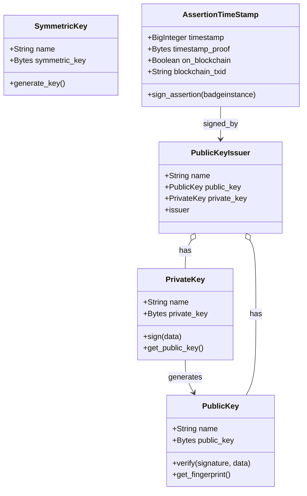
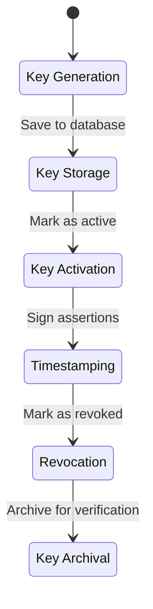
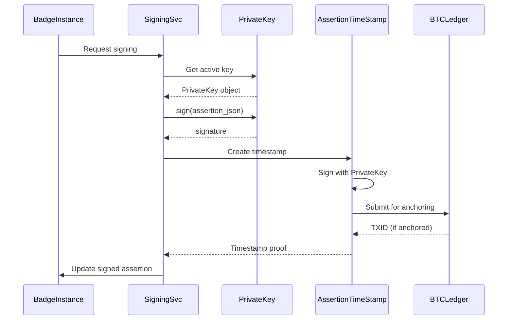

# Deep Dive: Signing Infrastructure (signing app)

## Overview

The `signing` app provides cryptographic infrastructure for securing badge assertions. It manages key pairs, assertion timestamping, and blockchain (BTC ledger) anchoring. Each badge assertion is signed with an institutional private key, producing a cryptographically verifiable credential.

## Responsibilities

- **Key Pair Management**: Generate, store, and rotate cryptographic key pairs
- **Assertion Timestamping**: Create timestamp proofs for badge assertions
- **BTC Ledger Integration**: Anchor timestamps to the Bitcoin blockchain
- **Public Key Distribution**: Serve public keys for assertion verification
- **Symmetric Key Management**: Manage shared secrets for internal services

## Architecture

### Models



### Key Lifecycle



### Assertion Signing Flow



## Key Files

| File | Purpose |
|------|---------|
| `models.py` | SymmetricKey, PrivateKey, PublicKey, PublicKeyIssuer, AssertionTimeStamp |
| `serializers.py` | DRF serializers for key management API |
| `api_urls.py` | REST API endpoints for key operations |
| `tsob.py` | Time-Stamped Open Badges signing logic |

## Implementation Details

### PublicKeyIssuer

Links a key pair to an institution:

```python
class PublicKeyIssuer(models.Model):
    name = models.CharField(max_length=255)
    public_key = models.ForeignKey(PublicKey, on_delete=models.PROTECT)
    private_key = models.ForeignKey(PrivateKey, on_delete=models.PROTECT)
    # The institution that owns these keys
```

Each institution should have one active key pair for signing assertions.

### AssertionTimeStamp

Creates timestamp proofs for assertions:

```python
class AssertionTimeStamp(models.Model):
    badgeinstance = models.OneToOneField(BadgeInstance, on_delete=models.PROTECT)
    timestamp = models.BigIntegerField()  # Unix timestamp
    timestamp_proof = models.BinaryField()  # Cryptographic proof
    on_blockchain = models.BooleanField(default=False)
    blockchain_txid = models.CharField(max_length=255, blank=True)
    
    def sign_assertion(self, badgeinstance):
        """Sign the assertion and optionally anchor to BTC ledger."""
        # 1. Serialize assertion to JSON
        # 2. Sign with PrivateKey
        # 3. Create timestamp proof
        # 4. If configured, submit to BTC ledger
```

### BTC Ledger Integration

When configured, timestamps are anchored to the Bitcoin blockchain:

```python
# In settings
BTC_LEDGER_URL = os.environ.get('BTC_LEDGER_URL', '')
BTC_LEDGER_API_KEY = os.environ.get('BTC_LEDGER_API_KEY', '')
```

The process:
1. Assertion is signed with the institution's private key
2. A timestamp proof is generated (hash + timestamp)
3. The proof is submitted to the BTC ledger API
4. The transaction ID is stored on `AssertionTimeStamp`
5. Verifiers can check the blockchain for proof of existence

### SymmetricKey

Shared secrets for internal service-to-service communication:

```python
class SymmetricKey(models.Model):
    name = models.CharField(max_length=255)
    symmetric_key = models.BinaryField()  # Raw bytes
    
    @classmethod
    def generate_key(cls, name):
        """Generate a new random symmetric key."""
        key = os.urandom(32)  # 256-bit key
        return cls.objects.create(name=name, symmetric_key=key)
```

## Dependencies

- **Internal**: `issuer` (BadgeInstance references)
- **External**: cryptography, pycryptodome

## API Interface

### Signing Endpoints (`/signing/`)

| Endpoint | Method | Description |
|-----------|--------|-------------|
| `/signing/symmetric-keys/` | GET/POST | List/create symmetric keys |
| `/signing/private-keys/` | GET/POST | List/create private keys |
| `/signing/public-keys/` | GET/POST | List/create public keys |
| `/signing/public-key-issuers/` | GET/POST | List/create key issuers |
| `/signing/assertion-timestamps/` | GET | List timestamps |

### Management Commands

| Command | Description |
|---------|-------------|
| `update_timestamp_proofs` | Process pending timestamps and submit to BTC ledger |

## Security Considerations

1. **Private Key Storage**: Private keys are stored in the database as binary fields. In production, consider HSM or cloud KMS integration.

2. **Key Rotation**: No automated key rotation. When a key pair is compromised or expires, a new `PublicKeyIssuer` must be created manually.

3. **Access Control**: Key management should be restricted to administrators. The current RBAC system provides institutional-level access.

4. **Backup**: Private keys must be backed up separately from the database. Loss of private keys means inability to sign new assertions (though existing signatures remain valid).

## Potential Improvements

1. **Automated Key Rotation**: Implement automatic key pair rotation with overlap period for seamless transition.

2. **HSM Integration**: Support for hardware security modules (AWS KMS, Azure Key Vault) for private key storage.

3. **Multiple Active Keys**: Allow multiple active key pairs per institution for gradual key rotation without breaking existing assertions.

4. **Key Expiry Dates**: Add `expires_at` field to `PublicKeyIssuer` with automatic deprecation warnings.

5. **Signature Verification Endpoint**: Public API endpoint for verifying assertion signatures, useful for third-party integrations.

6. **Ledger Agnostic**: Currently tied to BTC ledger. Consider abstracting to support other blockchains (Ethereum, Polygon).
