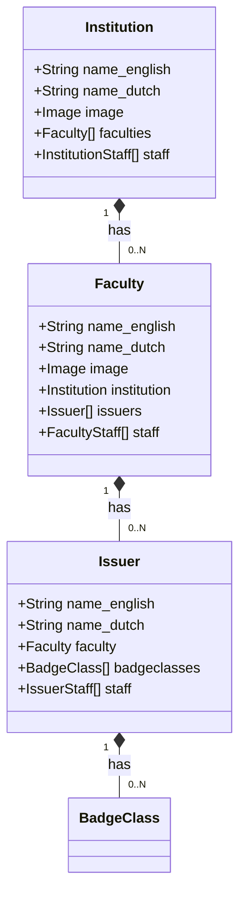
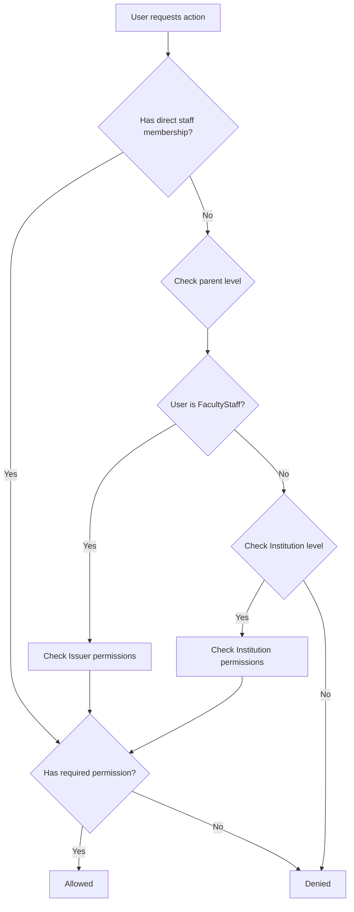

# Deep Dive: Institutional Hierarchy & RBAC (institution + staff)

## Overview

The institutional hierarchy provides a multi-level organizational structure: Institution → Faculty → Issuer. Each level has its own staff membership with granular permissions. This mirrors the organizational structure of Dutch universities and enables delegated badge management.

## Responsibilities

- **Hierarchical Organization**: Manage Institution → Faculty → Issuer structure
- **Role-Based Access Control**: Seven permission types at each hierarchy level
- **Permission Cascading**: Permissions cascade down the hierarchy
- **Staff Membership Management**: Track who has what permissions at each level

## Architecture

### Hierarchy Model



### Permission Model

```python
class PermissionedRelationshipBase(models.Model):
    """Abstract base for staff membership with permissions."""
    user = models.ForeignKey('badgeuser.BadgeUser', on_delete=models.CASCADE)
    
    # Seven permission types
    may_create = models.BooleanField(default=False)
    may_read = models.BooleanField(default=False)
    may_update = models.BooleanField(default=False)
    may_delete = models.BooleanField(default=False)
    may_award = models.BooleanField(default=False)
    may_sign = models.BooleanField(default=False)
    may_administrate_users = models.BooleanField(default=False)
    
    class Meta:
        abstract = True
```

### Permission Types

| Permission | Description | Used By |
|-----------|-------------|---------|
| `may_create` | Create child entities | Institution→Faculty, Faculty→Issuer, Issuer→BadgeClass |
| `may_read` | Read entities at this level | All operations |
| `may_update` | Update entity properties | Admin operations |
| `may_delete` | Delete entities | Admin operations |
| `may_award` | Award badges | BadgeClass-level, Issuer-level |
| `may_sign` | Sign/cryptographically prove badges | Issuer-level |
| `may_administrate_users` | Manage staff membership | All levels |

### Staff Models

```python
class InstitutionStaff(PermissionedRelationshipBase):
    institution = models.ForeignKey('institution.Institution', on_delete=models.CASCADE)

class FacultyStaff(PermissionedRelationshipBase):
    faculty = models.ForeignKey('institution.Faculty', on_delete=models.CASCADE)

class IssuerStaff(PermissionedRelationshipBase):
    issuer = models.ForeignKey('issuer.Issuer', on_delete=models.CASCADE)

class BadgeClassStaff(PermissionedRelationshipBase):
    badgeclass = models.ForeignKey('issuer.BadgeClass', on_delete=models.CASCADE)
```

### Permission Resolution



Permission resolution algorithm:
1. Check direct staff membership at the target level
2. If no direct membership, check parent level (BadgeClass → Issuer → Faculty → Institution)
3. If no membership found at any level, deny access
4. Permission check uses the `has_permissions()` method on `PermissionedModelMixin`

## Key Files

### institution app

| File | Purpose |
|------|---------|
| `models.py` | Institution, Faculty, BadgeClassTag |
| `api_urls.py` | REST API endpoints |
| `serializers.py` | DRF serializers |
| `schema.py` | GraphQL schema |
| `admin.py` | Django admin configuration |

### staff app

| File | Purpose |
|------|---------|
| `models.py` | InstitutionStaff, FacultyStaff, IssuerStaff, BadgeClassStaff |
| `mixins.py` | PermissionedModelMixin for permission checking |
| `api_urls.py` | Staff membership management endpoints |
| `serializers.py` | Staff membership serializers |
| `schema.py` | GraphQL schema for staff queries |

## Implementation Details

### PermissionedModelMixin

All domain models that need permission checking inherit this mixin:

```python
class PermissionedModelMixin:
    def has_permissions(self, user, permissions):
        """Check if user has all specified permissions at this level or parent levels."""
        # Check BadgeClassStaff → IssuerStaff → FacultyStaff → InstitutionStaff
        staff_classes = [
            ('badgeclass', BadgeClassStaff),
            ('issuer', IssuerStaff),
            ('faculty', FacultyStaff),
            ('institution', InstitutionStaff),
        ]
        
        for field_name, staff_class in staff_classes:
            if hasattr(self, field_name):
                parent = getattr(self, field_name)
                if hasattr(parent, 'staff'):
                    membership = parent.staff.filter(user=user).first()
                    if membership and all(
                        getattr(membership, perm, False) for perm in permissions
                    ):
                        return True
        return False
```

### Institution Model

```python
class Institution(BaseVersionedEntity, DefaultLanguageMixin, ...):
    name_english = models.CharField(max_length=512)
    name_dutch = models.CharField(max_length=512)
    image = models.ImageField(upload_to='uploads/institutions')
    faculties = models.ForeignKey('Faculty', related_name='institution', ...)
    staff = models.ManyToManyField('badgeuser.BadgeUser', through='InstitutionStaff')
```

### Faculty Model

```python
class Faculty(BaseVersionedEntity, DefaultLanguageMixin, ...):
    name_english = models.CharField(max_length=512)
    name_dutch = models.CharField(max_length=512)
    image = models.ImageField(upload_to='uploads/faculties')
    institution = models.ForeignKey('Institution', on_delete=models.CASCADE)
    issuers = models.ForeignKey('Issuer', related_name='faculty', ...)
    staff = models.ManyToManyField('badgeuser.BadgeUser', through='FacultyStaff')
```

### BadgeClassTag

Categorical tags for classifying badge classes:

```python
class BadgeClassTag(models.Model):
    name_english = models.CharField(max_length=255)
    name_dutch = models.CharField(max_length=255)
    institution = models.ForeignKey('Institution', on_delete=models.CASCADE)
```

## Dependencies

- **Internal**: `badgeuser`, `issuer`, `entity`, `basic_models`
- **External**: None (pure Django models)

## API Interface

### Institution Endpoints (`/institution/`)

| Endpoint | Method | Description |
|-----------|--------|-------------|
| `/institution/institutions/` | GET/POST | List/create institutions |
| `/institution/institutions/{entity_id}/` | GET/PUT/DELETE | Get/update/delete institution |
| `/institution/faculties/` | GET/POST | List/create faculties |
| `/institution/faculties/{entity_id}/` | GET/PUT/DELETE | Get/update/delete faculty |
| `/institution/tags/` | GET/POST | List/create badge tags |

### Staff Membership Endpoints (`/staff-membership/`)

| Endpoint | Method | Description |
|-----------|--------|-------------|
| `/staff-membership/institution-staff/` | GET/POST | Manage institution staff |
| `/staff-membership/faculty-staff/` | GET/POST | Manage faculty staff |
| `/staff-membership/issuer-staff/` | GET/POST | Manage issuer staff |
| `/staff-membership/badgeclass-staff/` | GET/POST | Manage badge class staff |

## Testing

- Permission resolution tests verify cascading behavior
- Staff membership CRUD tests verify permission field validation

## Potential Improvements

1. **Permission Inheritance Caching**: Current permission resolution queries the database for each level. Caching resolved permissions would improve performance for users with many memberships.

2. **Group-Based Permissions**: Currently permissions are per-user. Adding group support (e.g., "All faculty members") would simplify bulk permission assignment.

3. **Audit Trail for Staff Changes**: No built-in tracking of staff membership changes. django-auditlog could be integrated for compliance.

4. **Permission Templates**: Predefined permission sets (e.g., "Issuer Admin", "Badge Creator") would simplify staff assignment.

5. **Hierarchical Reporting**: Institution admins cannot currently see aggregate statistics across all faculties/issuers. A reporting dashboard would be valuable.
