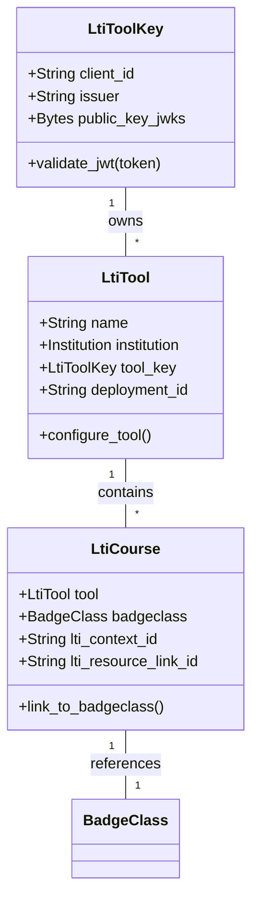
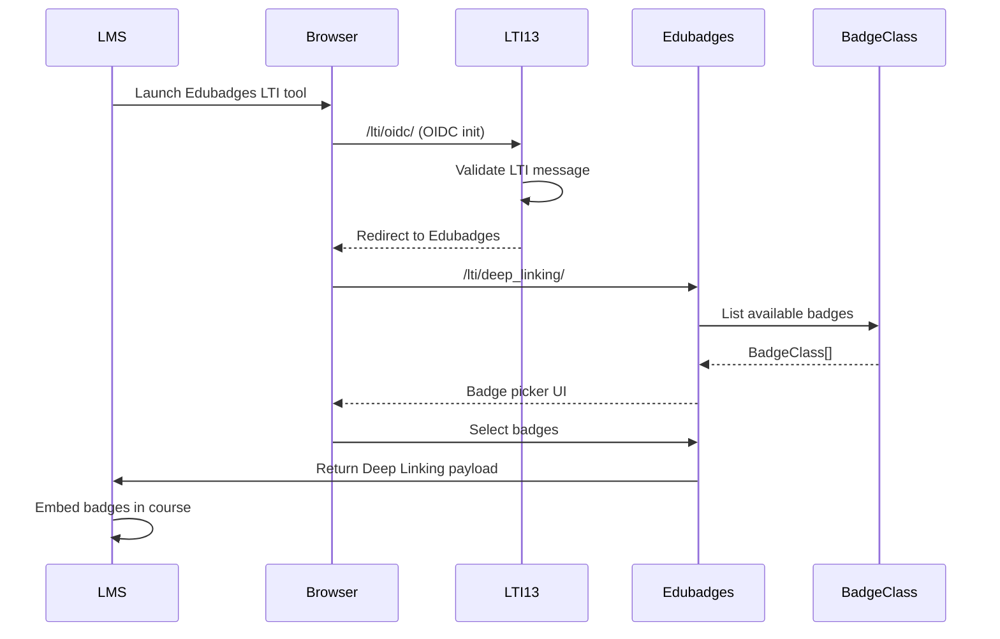

# Deep Dive: LTI Integration (lti13 + lti_edu)

## Overview

The LTI integration provides two layers of Learning Tools Interoperability support:
- **LTI 1.3** (`lti13` app): Modern OIDC-based integration with deep linking
- **LTI Edu** (`lti_edu` app): Legacy LTI 1.x integration for student enrollments

This enables Edubadges to function as an LTI tool within learning management systems like Canvas, Moodle, and Blackboard.

## Responsibilities

### LTI 1.3 (lti13)
- **OIDC Authentication**: LTI 1.3 OIDC initiation and JWT validation
- **Deep Linking**: Allow instructors to select and embed badges in LMS courses
- **Tool Configuration**: Register Edubadges as an LTI tool in the LMS
- **Course Registration**: Link BadgeClass instances to LMS courses
- **SameSite Cookie Handling**: Custom middleware for modern browser cookie policies

### LTI Edu (lti_edu)
- **Student Enrollment**: Track which students are enrolled in a BadgeClass
- **Legacy LTI Launch**: Handle LTI 1.x launch requests
- **Enrollment Management**: CRUD for student enrollments

## Architecture

### LTI 1.3 Model



### LTI Edu Model

```python
class StudentsEnrolled(models.Model):
    """Tracks student enrollments for a BadgeClass via LTI."""
    badgeclass = models.ForeignKey(BadgeClass, on_delete=models.CASCADE)
    lti_course = models.ForeignKey(LtiCourse, on_delete=models.CASCADE, null=True)
    user = models.ForeignKey(BadgeUser, on_delete=models.CASCADE)
    lti_role = models.CharField(max_length=255)  # Student, Instructor, etc.
```

### LTI 1.3 Deep Linking Flow



## Key Files

### lti13 app

| File | Purpose |
|------|---------|
| `models.py` | LtiToolKey, LtiTool, LtiCourse |
| `urls.py` | URL routing for LTI endpoints |
| `views.py` | OIDC launch, deep linking, LTI messages |
| `middleware.py` | SameSiteMiddleware for cookie handling |
| `schema.py` | GraphQL schema |
| `serializers.py` | DRF serializers |
| `admin.py` | Django admin configuration |

### lti_edu app

| File | Purpose |
|------|---------|
| `models.py` | StudentsEnrolled |
| `api_urls.py` | REST API endpoints |
| `schema.py` | GraphQL schema |
| `serializers.py` | DRF serializers |
| `admin.py` | Django admin configuration |

## Implementation Details

### LtiToolKey

Stores the cryptographic keys for LTI tool validation:

```python
class LtiToolKey(models.Model):
    client_id = models.CharField(max_length=255)  # LMS client ID
    issuer = models.CharField(max_length=255)  # LMS issuer URL
    public_key_jwks = models.BinaryField()  # JWKS-formatted public key
    
    def validate_jwt(self, token):
        """Validate an LTI 1.3 JWT using the stored public key."""
        # Uses PyLTI1p3 library for JWT validation
        # Checks issuer, audience, nonce, and expiration
```

### LtiTool

Configuration for an LTI tool installation:

```python
class LtiTool(models.Model):
    name = models.CharField(max_length=255)
    institution = models.ForeignKey(Institution, on_delete=models.CASCADE)
    tool_key = models.ForeignKey(LtiToolKey, on_delete=models.PROTECT)
    deployment_id = models.CharField(max_length=255, blank=True)
    
    def configure_tool(self):
        """Generate LTI tool configuration for LMS registration."""
        # Returns LTI registration document
```

### LtiCourse

Links a BadgeClass to an LMS course context:

```python
class LtiCourse(models.Model):
    tool = models.ForeignKey(LtiTool, on_delete=models.CASCADE)
    badgeclass = models.OneToOneField(BadgeClass, on_delete=models.CASCADE)
    lti_context_id = models.CharField(max_length=255)  # LMS course ID
    lti_resource_link_id = models.CharField(max_length=255)
```

### SameSiteMiddleware

Custom middleware for handling SameSite cookie policy:

```python
class SameSiteMiddleware:
    """Ensure SameSite=None; Secure cookies for LTI 1.3 iframe contexts."""
    def process_response(self, request, response):
        # Adjusts Set-Cookie headers for LTI frames
        pass
```

## Dependencies

- **Internal**: `institution`, `issuer`, `badgeuser`
- **External**: PyLTI1p3 (edubadges fork), django-cors-headers

### PyLTI1p3 Fork

The project uses a forked version of PyLTI1p3:
```
git+https://github.com/edubadges/pylti1.3@master#egg=PyLTI1p3
```

This fork contains Edubadges-specific modifications for their LTI integration needs.

## API Interface

### LTI 1.3 Endpoints (`/lti/`)

| Endpoint | Method | Description |
|-----------|--------|-------------|
| `/lti/oidc/` | GET | OIDC initiation |
| `/lti/deep_linking/` | POST | Deep linking return |
| `/lti/tool/` | GET/POST | List/create LTI tools |
| `/lti/tool/{entity_id}/` | GET/PUT/DELETE | Manage LTI tool |
| `/lti/course/` | GET/POST | List/create LTI courses |
| `/lti/course/{entity_id}/` | GET/PUT/DELETE | Manage LTI course |

### LTI Edu Endpoints (`/lti_edu/`)

| Endpoint | Method | Description |
|-----------|--------|-------------|
| `/lti_edu/enrollments/` | GET/POST | List/manage enrollments |
| `/lti_edu/enrollments/{entity_id}/` | GET/PUT/DELETE | Manage enrollment |

## Testing

- OIDC validation tests verify JWT parsing and signature checking
- Deep linking tests verify the LMS round-trip flow

## Potential Improvements

1. **LTI Advantage**: Implement LTI Advantage spec (Names Roles Provisioning, Deep Linking) for full LTI 1.3 compliance.

2. **Automatic Course Sync**: Currently courses are manually linked. Automatic sync with LMS course catalogs would reduce manual setup.

3. **LTI Progress/Outcome**: Implement LTI Outcome Service for bidirectional grade/score exchange with the LMS.

4. **Legacy LTI Deprecation**: The `lti_edu` app handles legacy LTI 1.x. Consider a migration path to deprecate this in favor of LTI 1.3.

5. **LTI Context Extension**: Store additional LTI context data (context_memberships_url, tool_consent) for advanced integrations.
