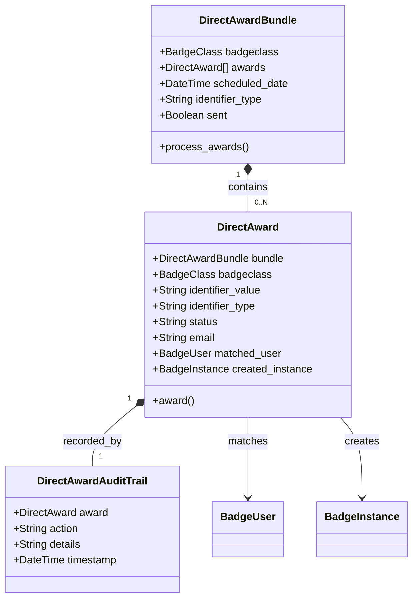
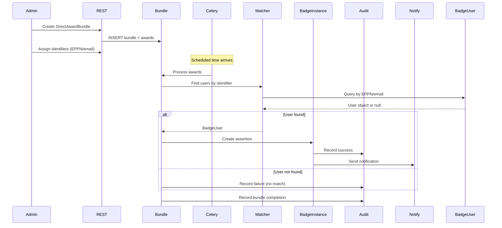

# Deep Dive: Direct Award System (directaward app)

## Overview

The Direct Award system enables bulk badge issuance, primarily for SIS (Student Information System) integration. It supports scheduled awards, EPPN-based user matching, and comprehensive audit trails for compliance.

## Responsibilities

- **Bulk Award Creation**: Create award bundles for mass badge issuance
- **Scheduled Processing**: Queue awards for future processing via Celery
- **User Matching**: Match award recipients by EPPN (eduID) or email address
- **Audit Trail**: Record every award action for compliance and debugging
- **Expiry Management**: Automatically clean up expired/unclaimed awards

## Architecture

### Models



### Award Processing Flow



## Key Files

| File | Purpose |
|------|---------|
| `models.py` | DirectAward, DirectAwardBundle, DirectAwardAuditTrail |
| `api_urls.py` | REST API endpoints |
| `schema.py` | GraphQL schema |
| `serializers.py` | DRF serializers |
| `admin.py` | Django admin configuration |
| `management/commands/` | Custom management commands |

## Implementation Details

### DirectAwardBundle

Container for a batch of direct awards:

```python
class DirectAwardBundle(models.Model):
    badgeclass = models.ForeignKey(BadgeClass, on_delete=models.CASCADE)
    scheduled_date = models.DateTimeField(null=True, blank=True)
    identifier_type = models.CharField(max_length=50)  # 'eppn' or 'email'
    sent = models.BooleanField(default=False)
    
    @property
    def total_awards(self):
        return self.awards.count()
    
    def process_awards(self):
        """Process all awards in this bundle."""
        for award in self.awards.all():
            award.award()
        self.sent = True
        self.save()
```

### DirectAward

Individual award within a bundle:

```python
class DirectAward(models.Model):
    bundle = models.ForeignKey(DirectAwardBundle, on_delete=models.CASCADE)
    badgeclass = models.ForeignKey(BadgeClass, on_delete=models.CASCADE)
    identifier_value = models.CharField(max_length=255)  # EPPN or email
    identifier_type = models.CharField(max_length=50)  # 'eppn' or 'email'
    status = models.CharField(max_length=50, default='pending')  # pending/awarded/failed
    email = models.CharField(max_length=255, blank=True)
    matched_user = models.ForeignKey(BadgeUser, on_delete=models.SET_NULL, null=True)
    created_instance = models.OneToOneField(BadgeInstance, on_delete=models.SET_NULL, null=True)
    
    def award(self):
        """Create a BadgeInstance for this award."""
        # 1. Find user by identifier
        # 2. Create BadgeInstance
        # 3. Update status
        # 4. Record audit trail
```

### DirectAwardAuditTrail

```python
class DirectAwardAuditTrail(models.Model):
    award = models.ForeignKey(DirectAward, on_delete=models.CASCADE)
    action = models.CharField(max_length=255)  # 'created', 'awarded', 'failed'
    details = models.TextField(blank=True)
    timestamp = models.DateTimeField(auto_now_add=True)
```

### User Matching

Users are matched by EPPN (eduID) or email:

```python
def match_user(identifier_type, identifier_value):
    """Find a BadgeUser by their identifier."""
    if identifier_type == 'eppn':
        # Match via StudentAffiliation.eppn
        affiliation = StudentAffiliation.objects.filter(eppn=identifier_value).first()
        return affiliation.user if affiliation else None
    elif identifier_type == 'email':
        # Match via BadgeUser.email or EmailAddress
        try:
            return BadgeUser.objects.get(email__iexact=identifier_value)
        except BadgeUser.DoesNotExist:
            return None
```

## Management Commands

| Command | Description |
|---------|-------------|
| `award_scheduled_direct_awards` | Process bundles with scheduled dates that have arrived |
| `delete_direct_awards` | Delete awards older than threshold (default 30 days) |
| `reminders_direct_awards` | Send reminders for awards approaching expiry |

### Configuration

```python
# Settings (from environment)
EXPIRY_DIRECT_AWARDS_REMINDER_THRESHOLD_DAYS = '42, 62'  # Send reminders at 42 and 62 days
EXPIRY_DIRECT_AWARDS_DELETION_THRESHOLD_DAYS = 82  # Delete unclaimed after 82 days
DIRECT_AWARDS_DELETION_THRESHOLD_DAYS = 30  # Delete processed awards after 30 days
```

## Dependencies

- **Internal**: `issuer`, `badgeuser`, `notifications`, `entity`
- **External**: Celery (for scheduled processing)

## API Interface

### Direct Award Endpoints (`/directaward/`)

| Endpoint | Method | Description |
|-----------|--------|-------------|
| `/directaward/bundles/` | GET/POST | List/create award bundles |
| `/directaward/bundles/{entity_id}/` | GET/PUT/DELETE | Manage bundle |
| `/directaward/awards/` | GET/POST | List/create awards |
| `/directaward/awards/{entity_id}/` | GET/PUT/DELETE | Manage award |
| `/directaward/awards-accept/{entity_id}/` | POST | Accept a direct award |

## Testing

- Award matching tests verify EPPN and email lookups
- Bundle processing tests verify the award lifecycle
- Audit trail tests verify compliance logging

## Potential Improvements

1. **Partial Failure Handling**: Currently if one award in a bundle fails, it's unclear if the rest succeed. Implement per-award error handling with detailed status reporting.

2. **CSV Import**: No built-in CSV/Excel import for award lists. Consider adding bulk import from file upload.

3. **Award Templates**: Support reusable award configurations (same badge, same identifier type, recurring schedule).

4. **Notification Customization**: Custom email templates per bundle would allow institutional branding.

5. **Webhook Notifications**: External webhook callback when a bundle completes, for SIS integration feedback.

6. **Duplicate Detection**: Automatic detection of duplicate identifiers within a bundle before processing.
