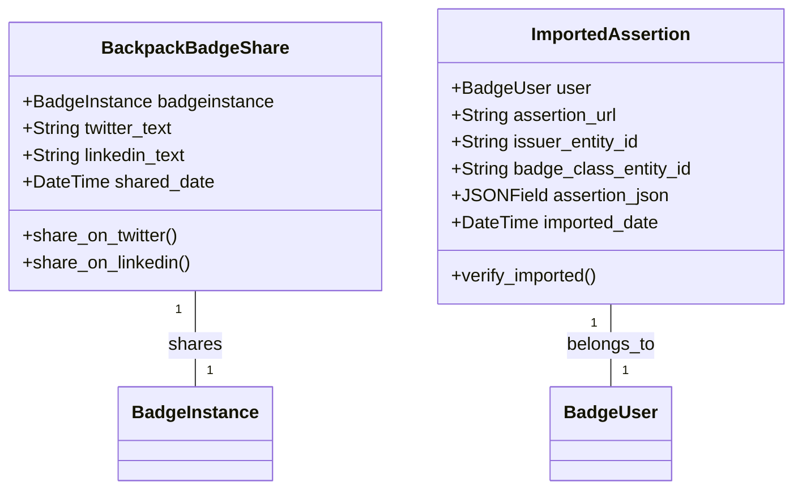

# Deep Dive: Backpack & Public Verification (backpack + public)

## Overview

The Backpack app manages user badge collections, while the Public app provides Open Badges-compliant JSON-LD endpoints for badge verification. Together, they enable users to manage their credentials and third parties to verify them.

## Responsibilities

### Backpack
- **User Collections**: Aggregate all badges earned by a user
- **Badge Sharing**: Share badge profiles to social media (Twitter, LinkedIn)
- **Imported Assertions**: Import badges from other issuers
- **Profile Management**: User's public badge profile page

### Public
- **JSON-LD Serving**: Serve Open Badges-compliant JSON-LD for all entities
- **Assertion Verification**: Verify badge assertions cryptographically
- **Recipient Lookup**: Look up recipient names by assertion identity
- **Image Serving**: Serve badge issuer and class images

## Architecture

### Backpack Models



### Public API Structure

```
/public/
  ├── institutions/<entity_id>/        # Institution JSON-LD
  ├── issuers/<entity_id>/             # Issuer JSON-LD
  ├── issuers/<entity_id>/badges/      # Issuer's badges list
  ├── badges/<entity_id>/              # BadgeClass JSON-LD
  ├── assertions/<entity_id>/          # BadgeInstance JSON-LD
  ├── assertions/validate/<entity_id>/ # Assertion validation
  ├── assertions/identity/<identity>/<salt>/  # Recipient name lookup
  ├── validator/info                   # Validator version info
  └── images/<type>/<entity_id>/       # Entity images
```

## Key Files

### backpack app

| File | Purpose |
|------|---------|
| `models.py` | BackpackBadgeShare, ImportedAssertion |
| `views.py` | Share views and badge profile rendering |
| `api_urls.py` | REST API endpoints |
| `share_urls.py` | Legacy share redirects (Twitter, LinkedIn) |

### public app

| File | Purpose |
|------|---------|
| `public_api.py` | JSON-LD views for all entity types |
| `public_api_urls.py` | URL routing for public endpoints |

## Implementation Details

### JSON-LD Serialization

The `issuer.utils` module handles JSON-LD serialization:

```python
from issuer.utils import get_obi_context, CURRENT_OBI_VERSION

def get_json_ld_for_assertion(badgeinstance):
    """Serialize a BadgeInstance to Open Badges JSON-LD."""
    context = get_obi_context(badgeinstance.obi_version)
    
    data = {
        '@context': context,
        '@type': 'BadgeAssertion',
        '@id': f'{settings.DEFAULT_DOMAIN}/public/assertions/{badgeinstance.entity_id}',
        'id': f'{settings.DEFAULT_DOMAIN}/public/assertions/{badgeinstance.entity_id}',
        'name': f'{badgeinstance.user.validated_name} - {badgeinstance.badgeclass.name}',
        'achievement': {
            '@type': 'BadgeClass',
            'id': f'{settings.DEFAULT_DOMAIN}/public/badges/{badgeinstance.badgeclass.entity_id}',
            'name': badgeinstance.badgeclass.name,
            'description': badgeinstance.badgeclass.description,
            'criteria': {
                'narrative': badgeinstance.badgeclass.criteria,
                'href': badgeinstance.badgeclass.criteria_url,
            },
        },
        'issuer': {...},  # Issuer JSON-LD
        'recipient': {...},  # Hashed recipient identity
        'issuanceDate': badgeinstance.issued_nano,
        'verification': {...},  # Cryptographic verification
        'evidence': [...],  # Evidence URLs
    }
    
    if badgeinstance.revoked:
        data['verification'] = {
            '@type': 'VerifiableCredential',
            'type': ['Revoked'],
        }
    
    return data
```

### Assertion Verification

```python
def verify_assertion(badgeinstance):
    """Verify the cryptographic signature of an assertion."""
    public_key_issuer = badgeinstance.public_key_issuer
    public_key = public_key_issuer.public_key
    
    # Get the signed assertion JSON
    assertion_json = badgeinstance.assertion_json
    
    # Verify signature using the public key
    is_valid = public_key.verify(
        assertion_json['signature'],
        assertion_json['signed_data']
    )
    
    # Check timestamp proof
    timestamp = badgeinstance.timestamp
    if timestamp:
        timestamp_valid = verify_timestamp_proof(
            timestamp.timestamp_proof,
            timestamp.timestamp
        )
    
    return {
        'valid': is_valid and timestamp_valid,
        'revoked': badgeinstance.revoked,
        'issuer': public_key_issuer.name,
        'blockchain_txid': timestamp.blockchain_txid if timestamp else None,
    }
```

### Recipient Identity Lookup

Open Badges uses hashed recipient identities for privacy:

```python
def get_recipient_name(identity, salt):
    """Look up a recipient's name by their hashed identity."""
    # identity = SHA256(salt + email)
    # This allows verification without exposing email
    badgeinstance = BadgeInstance.objects.get(entity_id=identity)
    user = badgeinstance.user
    return user.validated_name
```

### Badge Sharing

```python
class BackpackBadgeShare(models.Model):
    badgeinstance = models.OneToOneField(BadgeInstance, on_delete=models.CASCADE)
    twitter_text = models.TextField(blank=True)
    linkedin_text = models.TextField(blank=True)
    shared_date = models.DateTimeField(null=True, blank=True)
    
    def share_on_twitter(self):
        """Generate Twitter share URL with badge assertion link."""
        url = f'https://twitter.com/intent/tweet?text={quote(self.twitter_text)}&url={quote(self.badgeinstance assertion_url)}'
        return url
    
    def share_on_linkedin(self):
        """Generate LinkedIn share URL."""
        url = f'https://www.linkedin.com/sharing/share-offsite/?url={quote(self.badgeinstance.assertion_url)}'
        return url
```

## Dependencies

- **Internal**: `issuer`, `badgeuser`, `signing`, `entity`
- **External**: PyLD (for JSON-LD processing)

## API Interface

### Public Endpoints (`/public/`)

| Endpoint | Description |
|----------|-------------|
| `GET /public/assertions/{entity_id}` | Get assertion as JSON-LD |
| `GET /public/assertions/validate/{entity_id}` | Validate assertion signature |
| `GET /public/assertions/identity/{identity}/{salt}` | Get recipient name |
| `GET /public/badges/{entity_id}` | Get badge class as JSON-LD |
| `GET /public/issuers/{entity_id}` | Get issuer as JSON-LD |
| `GET /public/institutions/{entity_id}` | Get institution as JSON-LD |
| `GET /public/validator/info` | Validator version info |
| `GET /public/images/{type}/{entity_id}` | Get entity image |

### Backpack Endpoints (`/earner/`)

| Endpoint | Method | Description |
|-----------|--------|-------------|
| `/earner/badge-instances/` | GET | User's badge instances |
| `/earner/badge-instances/{entity_id}/` | GET | Single badge instance |
| `/earner/shared/` | GET/POST | Badge sharing management |
| `/earner/imported/` | GET/POST | Imported assertions |

## Testing

- JSON-LD validation tests verify Open Badges spec compliance
- Signature verification tests verify cryptographic correctness
- Public endpoint tests verify correct serialization

## Potential Improvements

1. **Caching for Public Endpoints**: Public JSON-LD endpoints are read-heavy. Adding Redis or Memcached caching would reduce database load.

2. **VCDM Support**: Open Badges 3 uses Verifiable Credential Data Model (VCDM). The public app currently serves OBI 1.1/2.0. Consider adding VCDM serialization.

3. **Bulk Export**: No endpoint for exporting all of a user's badges in a single JSON-LD document (credential issuance).

4. **QR Code Generation**: Badge assertions could include QR codes for offline verification.

5. **Expiration Dates**: Badge assertions don't support expiration dates. Consider adding `expirationDate` to the JSON-LD output.
