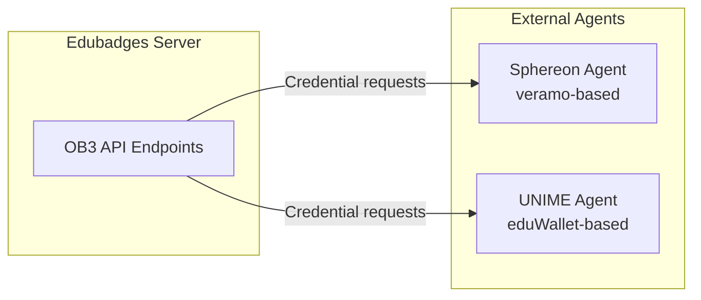
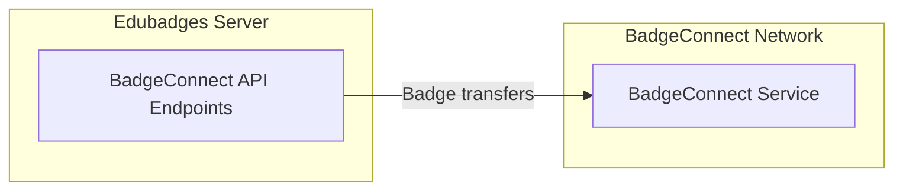

# Deep Dive: Open Badges 3 & BadgeConnect (ob3 + badge_connect)

## Overview

The `ob3` and `badge_connect` apps provide integrations for next-generation badge standards:
- **OB3** (`ob3`): Open Badges 3 / W3C Verifiable Credentials integration
- **BadgeConnect** (`badge_connect`): BadgeConnect protocol for cross-platform badge portability

Both are API-proxied integrations that forward requests to external agent services.

## Responsibilities

### OB3 (Open Badges 3)
- **Verifiable Credentials**: Issue badges as W3C Verifiable Credentials
- **Agent Proxy**: Forward credential requests to OB3 agent services
- **Multi-Agent Support**: Support multiple credential issuing agents (Sphereon, UNIME)
- **Credential Wallet Integration**: Enable badge wallets to receive and verify credentials

### BadgeConnect
- **Cross-Platform Portability**: Enable badge transfer between different badge platforms
- **API Proxy**: Forward BadgeConnect protocol requests to external services
- **Badge Mapping**: Map local badge entities to BadgeConnect format

## Architecture

### OB3 Model



### BadgeConnect Model



## Key Files

### ob3 app

| File | Purpose |
|------|---------|
| `api.py` | OB3 API endpoint handlers |
| `api_urls.py` | URL routing |
| `serializers.py` | OB3-specific serializers |

### badge_connect app

| File | Purpose |
|------|---------|
| `api.py` | BadgeConnect API endpoint handlers |
| `api_urls.py` | URL routing |

## Implementation Details

### Configuration

```python
# Settings (from environment)
OB3_AGENT_URL_SPHEREON = os.environ.get('OB3_AGENT_URL_SPHEREON', 'http://veramo-agent:3000')
OB3_AGENT_AUTHZ_TOKEN_SPHEREON = os.environ.get('OB3_AGENT_AUTHZ_TOKEN_SPHEREON', '')
OB3_AGENT_URL_UNIME = os.environ.get('OB3_AGENT_URL_UNIME', 'https://agent.poc9.eduwallet.nl')
```

### OB3 Agent Proxy

```python
class OB3ProxyView(APIView):
    """Proxy requests to OB3 agent services."""
    authentication_classes = [BadgrOAuth2Authentication]
    
    def post(self, request):
        agent_url = settings.OB3_AGENT_URL_SPHEREON
        auth_token = settings.OB3_AGENT_AUTHZ_TOKEN_SPHEREON
        
        # Forward request to Sphereon agent
        response = requests.post(
            f'{agent_url}/{request.path}',
            json=request.data,
            headers={
                'Authorization': f'Bearer {auth_token}',
                'Content-Type': 'application/json',
            },
        )
        
        return Response(response.json(), status=response.status_code)
```

### BadgeConnect Proxy

```python
class BadgeConnectProxyView(APIView):
    """Proxy requests to BadgeConnect service."""
    authentication_classes = [BadgrOAuth2Authentication]
    
    def post(self, request):
        # Forward to BadgeConnect network
        response = requests.post(
            f'{settings.BADGE_CONNECT_URL}/{request.path}',
            json=request.data,
            headers=self.get_auth_headers(),
        )
        
        return Response(response.json(), status=response.status_code)
```

## Dependencies

- **Internal**: `issuer`, `badgeuser`, `entity`
- **External**: requests (for agent proxying)

### External Services

| Service | URL | Purpose |
|---------|-----|---------|
| **Sphereon Agent** | `OB3_AGENT_URL_SPHEREON` | Verifiable Credential issuing (Veramo-based) |
| **UNIME Agent** | `OB3_AGENT_URL_UNIME` | eduWallet credential integration |
| **BadgeConnect Network** | `BADGE_CONNECT_URL` | Cross-platform badge portability |

## API Interface

### OB3 Endpoints (`/ob3/`)

| Endpoint | Method | Description |
|-----------|--------|-------------|
| `/ob3/credentials/` | POST | Issue verifiable credential |
| `/ob3/presentations/` | POST | Submit verifiable presentation |
| `/ob3/status/` | GET | Check credential status |

### BadgeConnect Endpoints (`/badge_connect/`)

| Endpoint | Method | Description |
|-----------|--------|-------------|
| `/badge_connect/badges/` | GET/POST | List/import badges |
| `/badge_connect/transfer/` | POST | Initiate badge transfer |

## Testing

- Agent proxy tests verify request forwarding
- Credential format tests verify W3C VC compliance

## Potential Improvements

1. **Direct VC Issuance**: Currently a proxy to external agents. Consider direct VC issuance from the Django app for better control and auditability.

2. **Credential Status List**: Implement W3C Credential Status List for efficient revocation checking.

3. ** decentralized Identifiers (DIDs)**: Add DID resolution and creation for issuers and earners.

4. **BadgeConnect Discovery**: Implement BadgeConnect service discovery for automatic network integration.

5. **Offline Credential Verification**: Support offline verification of credentials using embedded DIDs.
