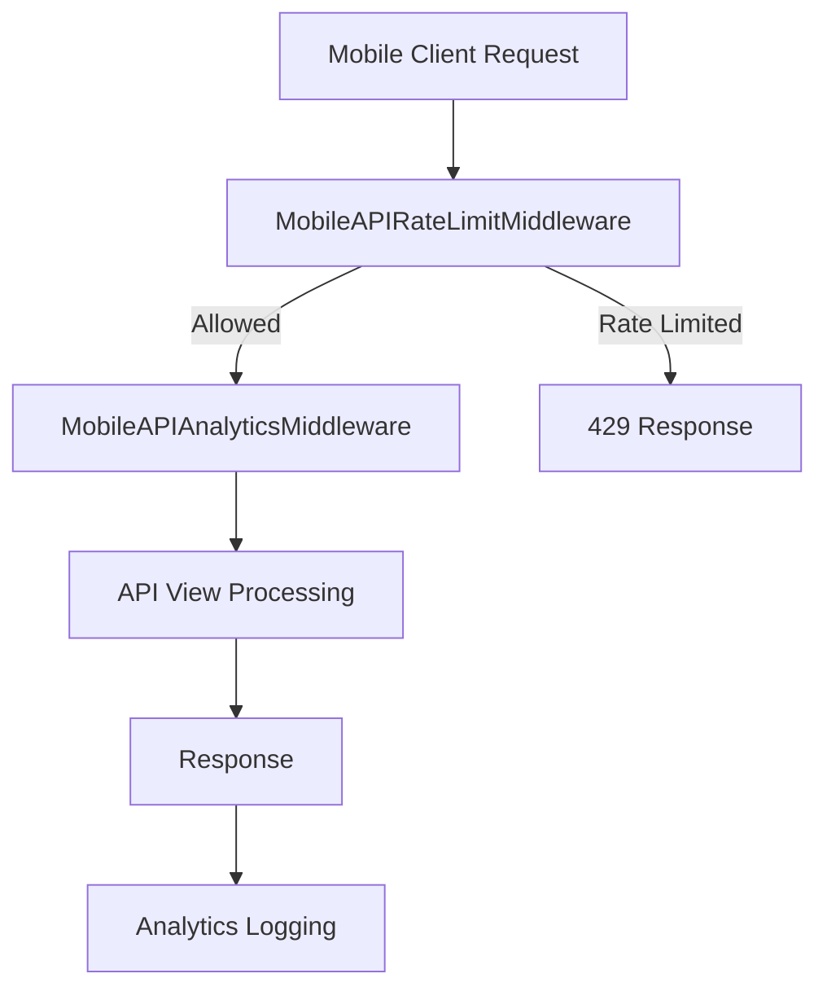

# Mobile API Analytics and Rate Limiting - Design Document

## 1. Summary

This design document proposes implementing comprehensive analytics tracking and rate limiting for the edubadges mobile API to improve monitoring, security, and performance management.

### Problem Statement

The current mobile API lacks visibility into usage patterns and has no protection against abuse or excessive usage. This creates several challenges:

1. **No usage analytics**: We cannot track API adoption, identify popular endpoints, or understand device distribution
2. **No performance monitoring**: We lack data on response times and error rates for mobile clients
3. **No abuse protection**: The API is vulnerable to excessive usage that could degrade performance for all users
4. **No device management**: We cannot identify or manage individual mobile devices

### Proposed Solution

Implement two integrated features:

1. **Analytics Tracking System**: Comprehensive request logging with device information and performance metrics
2. **Rate Limiting System**: Per-device rate limiting to prevent abuse while allowing legitimate usage

## 2. Context and Background

### Current State

- Mobile API handles authentication, badge management, and user data for iOS/Android apps
- No tracking of mobile-specific usage patterns
- No protection against API abuse from mobile clients
- Limited visibility into mobile client performance and errors

### Industry Standards

- Mobile APIs typically implement rate limiting (e.g., 100-1000 requests/hour per device)
- Analytics tracking is standard for monitoring API health and usage patterns
- Device identification is common for mobile apps to enable device-specific features

### User Impact

- **Mobile App Users**: Will experience more reliable API performance due to abuse prevention
- **Administrators**: Will gain visibility into API usage and device distribution
- **Developers**: Will have tools to monitor and optimize mobile API performance

## 3. Detailed Design

### Analytics Tracking System

#### Database Schema

**MobileDevice Table:**
```sql
CREATE TABLE mobile_api_mobiledevice (
    id CHAR(36) PRIMARY KEY,
    device_id VARCHAR(255) UNIQUE NOT NULL,
    device_type VARCHAR(50),
    device_model VARCHAR(100),
    app_version VARCHAR(50),
    os_version VARCHAR(50),
    created_at DATETIME NOT NULL,
    last_seen DATETIME NOT NULL,
    INDEX (device_id),
    INDEX (created_at),
    INDEX (last_seen)
);
```

**MobileAPIRequestLog Table:**
```sql
CREATE TABLE mobile_api_mobileapirequestlog (
    id BIGINT PRIMARY KEY AUTO_INCREMENT,
    device_id CHAR(36),
    user_id INT,
    endpoint VARCHAR(255) NOT NULL,
    method VARCHAR(10) NOT NULL,
    status_code INT NOT NULL,
    response_time_ms INT NOT NULL,
    timestamp DATETIME NOT NULL,
    ip_address VARCHAR(45),
    user_agent TEXT,
    FOREIGN KEY (device_id) REFERENCES mobile_api_mobiledevice(id) ON DELETE SET NULL,
    FOREIGN KEY (user_id) REFERENCES badgeuser_badgeuser(id) ON DELETE SET NULL,
    INDEX (timestamp),
    INDEX (endpoint),
    INDEX (method),
    INDEX (status_code),
    INDEX (device_id),
    INDEX (user_id)
);
```

#### Request Flow



#### Required Headers

Mobile clients must send:
- `X-Requested-With: mobile` (identifies mobile API calls)
- `X-Device-ID: <unique-identifier>` (device identification)
- `X-Device-Type: iOS|Android` (device platform)
- `X-Device-Model: <model>` (device model)
- `X-App-Version: <version>` (app version)
- `X-OS-Version: <version>` (OS version)

### Rate Limiting System

#### Algorithm

- **Cache-based counter**: Uses Django's cache framework (Redis recommended)
- **Sliding window**: Tracks requests within configurable time periods
- **Per-device limits**: Limits applied based on device ID
- **Automatic cleanup**: Cache entries expire automatically

#### Configuration

- **Default limit**: 100 requests/hour per device
- **Configurable limits**: Can be set per endpoint using `mobile_api_rate_limit` attribute
- **Supported periods**: second, minute, hour, day

#### Rate Limit Examples

```python
# Configuration examples
"10/minute"      # 10 requests per minute
"100/hour"       # 100 requests per hour (default)
"1000/day"       # 1000 requests per day
"5/second"       # 5 requests per second
```

### Integration Points

#### Middleware Stack

```python
MIDDLEWARE = [
    # ... other middleware ...
    'mobile_api.middleware.MobileAPIRateLimitMiddleware',  # First
    'mobile_api.middleware.MobileAPIAnalyticsMiddleware',  # Second
    # ... other middleware ...
]
```

#### Authentication Integration

The `MobileAPIAuthentication` class sets `request.mobile_api_call = True` to identify mobile API requests.

### API Endpoints

#### New Endpoints

1. **GET /mobile/api/test-analytics**
   - Test analytics tracking functionality
   - Returns device detection status

2. **GET /mobile/api/test-rate-limit**
   - Test rate limiting behavior
   - Returns rate limit status

3. **GET /mobile/api/analytics-summary**
   - Get aggregated analytics data
   - Returns usage statistics by endpoint

#### Response Examples

**Analytics Test:**
```json
{
    "message": "Analytics tracking is working",
    "device_detected": true,
    "device_id": "abc123-def456",
    "user_agent": "MobileApp/1.0 (iPhone; iOS 15.4)"
}
```

**Rate Limit Exceeded:**
```json
{
    "error": "rate_limit_exceeded",
    "message": "API rate limit exceeded",
    "retry_after": 3600
}
```

**Analytics Summary:**
```json
{
    "time_range": "last_24_hours",
    "total_requests": 100,
    "unique_devices": 10,
    "active_users": 5,
    "endpoints": {
        "/mobile/api/login": 40,
        "/mobile/api/badge-instances": 30,
        "/mobile/api/test-analytics": 30
    }
}
```

## 4. Implementation Plan

### Phase 1: Foundation (Completed)
- [x] Create database models for MobileDevice and MobileAPIRequestLog
- [x] Implement MobileAPIAnalyticsMiddleware for request logging
- [x] Implement MobileAPIRateLimitMiddleware for rate limiting
- [x] Create utility classes for analytics and rate limiting
- [x] Add admin interfaces for data management

### Phase 2: Integration (Completed)
- [x] Update MobileAPIAuthentication to set mobile_api_call flag
- [x] Add middleware to Django settings in correct order
- [x] Create test endpoints for verification
- [x] Write comprehensive documentation

### Phase 3: Deployment
- [ ] Run database migrations in production
- [ ] Monitor system performance and resource usage
- [ ] Adjust rate limits based on real-world usage patterns
- [ ] Set up monitoring and alerts for unusual activity

### Phase 4: Enhancement
- [ ] Implement real-time analytics dashboard
- [ ] Add export functionality for analytics data
- [ ] Implement tiered rate limits for different user types
- [ ] Add device management features for users

## 5. Open Questions and Risks

### Open Questions

1. **Data Retention Policy**: How long should we retain analytics data?
   - Proposal: 30 days for detailed logs, 1 year for aggregated statistics

2. **Device ID Privacy**: Should device IDs be hashed or encrypted?
   - Proposal: Use UUIDs and consider hashing for long-term storage

3. **Rate Limit Adjustments**: What criteria should trigger rate limit changes?
   - Proposal: Monitor usage patterns and adjust based on 95th percentile usage

### Risks and Mitigations

| Risk | Likelihood | Impact | Mitigation Strategy |
|------|-----------|--------|---------------------|
| Performance impact from analytics logging | Medium | High | Optimize database indexes, implement caching for analytics queries |
| False positives in rate limiting | Low | Medium | Implement grace period, provide clear error messages with retry-after |
| Data privacy concerns | Medium | High | Anonymize sensitive data, implement data retention policies, comply with GDPR |
| Cache performance issues | High | Medium | Monitor cache hit/miss ratios, ensure sufficient Redis memory, implement fallback to database |

## 6. Monitoring and Metrics

### Key Metrics to Track

1. **API Usage**: Requests per endpoint, unique devices, active users
2. **Performance**: Average response times, error rates by endpoint
3. **Rate Limiting**: Number of rate-limited requests, devices hitting limits
4. **Device Distribution**: iOS vs Android, app versions, device models
5. **Geographic Distribution**: Requests by region (via IP address)

### Monitoring Tools

1. **Django Admin**: Built-in interface for analytics data
2. **Prometheus/Grafana**: For real-time monitoring and alerting
3. **Custom Dashboard**: Web interface for analytics visualization
4. **Logging**: Structured logs for debugging and auditing

### Alerting Criteria

1. **Sudden spikes**: 2x increase in request volume within 1 hour
2. **High error rates**: >5% errors for any endpoint
3. **Rate limit violations**: >10% of requests being rate-limited
4. **Unusual devices**: New device models or unexpected user agents

## 7. Future Enhancements

### Short-term (3-6 months)
- Real-time analytics dashboard
- CSV/Excel export functionality
- Tiered rate limits (basic vs premium users)
- Burst capacity for short-term spikes

### Long-term (6-12 months)
- Machine learning for anomaly detection
- Predictive analytics for capacity planning
- Device management portal for users
- Integration with existing monitoring systems

## 8. Appendix

### Mobile Client Integration Examples

**iOS (Swift):**
```swift
var request = URLRequest(url: URL(string: "https://api.example.com/mobile/api/badge-instances")!)
request.setValue("Bearer YOUR_ACCESS_TOKEN", forHTTPHeaderField: "Authorization")
request.setValue("mobile", forHTTPHeaderField: "X-Requested-With")
request.setValue(UIDevice.current.identifierForVendor?.uuidString, forHTTPHeaderField: "X-Device-ID")
request.setValue("iOS", forHTTPHeaderField: "X-Device-Type")
request.setValue(UIDevice.current.model, forHTTPHeaderField: "X-Device-Model")
request.setValue(Bundle.main.infoDictionary?["CFBundleShortVersionString"] as? String, forHTTPHeaderField: "X-App-Version")
request.setValue(UIDevice.current.systemVersion, forHTTPHeaderField: "X-OS-Version")
```

**Android (Kotlin):**
```kotlin
val client = OkHttpClient()
val request = Request.Builder()
    .url("https://api.example.com/mobile/api/badge-instances")
    .addHeader("Authorization", "Bearer YOUR_ACCESS_TOKEN")
    .addHeader("X-Requested-With", "mobile")
    .addHeader("X-Device-ID", Settings.Secure.getString(contentResolver, Settings.Secure.ANDROID_ID))
    .addHeader("X-Device-Type", "Android")
    .addHeader("X-Device-Model", Build.MODEL)
    .addHeader("X-App-Version", BuildConfig.VERSION_NAME)
    .addHeader("X-OS-Version", Build.VERSION.RELEASE)
    .build()
```

### Testing Commands

```bash
# Test analytics tracking
curl -H "X-Requested-With: mobile" \
     -H "X-Device-ID: test-device-123" \
     -H "X-Device-Type: iOS" \
     -H "X-App-Version: 1.0.0" \
     http://localhost:8000/mobile/api/test-analytics

# Test rate limiting
for i in {1..15}; do
    curl -H "X-Requested-With: mobile" \
         -H "X-Device-ID: test-device-456" \
         http://localhost:8000/mobile/api/test-rate-limit
    echo ""
done

# Get analytics summary
curl -H "X-Requested-With: mobile" \
     http://localhost:8000/mobile/api/analytics-summary
```

### Database Indexes

**MobileDevice Indexes:**
- `device_id`: For quick device lookup
- `created_at`: For time-based queries
- `last_seen`: For active device identification

**MobileAPIRequestLog Indexes:**
- `timestamp`: For time-range queries
- `endpoint`: For endpoint-specific analytics
- `method`: For HTTP method analysis
- `status_code`: For error rate monitoring
- `device_id`: For device-specific analytics
- `user_id`: For user-specific analytics

### Performance Considerations

1. **Database**: Consider partitioning large tables for high-volume APIs
2. **Caching**: Use Redis for rate limiting cache with sufficient memory
3. **Read Replicas**: Use read replicas for analytics queries
4. **Batch Processing**: Implement batch processing for analytics aggregation
5. **Data Retention**: Implement automated data cleanup policies

### Security Considerations

1. **Device ID Spoofing**: Monitor for unusual device patterns
2. **DDoS Protection**: Rate limiting is first line of defense
3. **Data Privacy**: Comply with GDPR and other regulations
4. **API Keys**: Consider for sensitive endpoints
5. **Encryption**: Encrypt sensitive data at rest

This design document follows the Amazon-style format with clear sections for context, detailed design, implementation plan, risks, and future enhancements. The document provides comprehensive guidance for implementing and maintaining the mobile API analytics and rate limiting features.