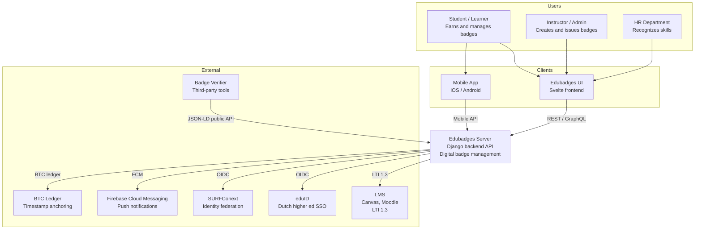
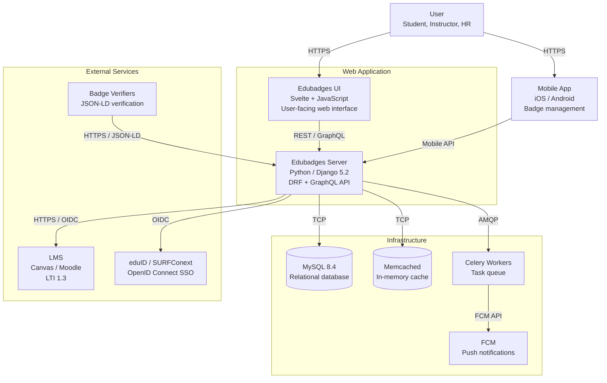
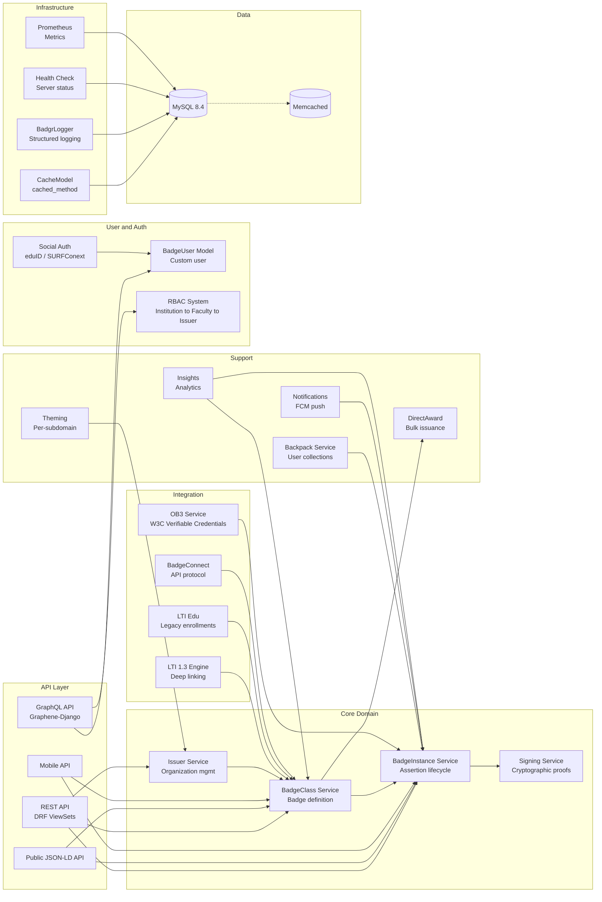

# Architecture Overview

## System Context (C4 Level 1)

Edubadges Server sits at the center of a digital badge ecosystem, connecting educational institutions with learning management systems, authentication providers, and mobile/web clients.



## Container Architecture (C4 Level 2)



## Component Architecture (C4 Level 3)



## Architectural Patterns

### 1. Entity-ID Based Routing
Every major entity uses a UUID-based `entity_id` for URL routing and JSON-LD `@id` fields, enabling:
- Stable, opaque identifiers across all APIs
- JSON-LD `@id` compliance with Open Badges specification
- Decoupled URLs from database primary keys

### 2. Hierarchical Permission System
RBAC via `PermissionedRelationshipBase` with cascading permissions:

```
Institution (admin)
  └── Faculty (staff)
      └── Issuer (staff)
          └── BadgeClass (staff)
              └── BadgeInstance (awarded)
```

Seven permission types cascade down the hierarchy:
- `may_create` — create child entities
- `may_read` — read entities
- `may_update` — update entities
- `may_delete` — delete entities
- `may_award` — award badges
- `may_sign` — sign/cryptographically prove badges
- `may_administrate_users` — manage staff membership

### 3. Three-Layer API Strategy
| Layer | Technology | Purpose |
|-------|-----------|---------|
| **REST API** | DRF ViewSets | CRUD operations, versioned (v1, v2) |
| **GraphQL API** | Graphene-Django | Complex queries, aggregations |
| **Public JSON-LD** | Custom views | Open Badges spec compliance, verification |

### 4. Caching Layer
Custom `CacheModel` base class with `@cached_method` decorator provides:
- Automatic method-level caching with cache invalidation on save/delete
- Per-model cache keys based on entity_id
- Memcached-backed storage via pymemcache

### 5. Badge Instance (Assertion) Lifecycle
```
Created → Submitted for Timestamping → Signed → Awarded → [Revoked]
```
Each badge instance progresses through cryptographic signing with timestamp proofs anchored to the BTC ledger.

### 6. Environment-Driven Configuration
All configuration is environment-variable driven via `env_vars.sh`. No hardcoded secrets. Docker Compose for local development.

### 7. Multi-Language Support
Dutch/English bilingual content for Institutions, Faculties, Issuers, and BadgeClasses:
- `name_english` / `name_dutch`
- `description_english` / `description_dutch`
- `criteria_english` / `criteria_dutch`

## Module Breakdown

### Core Infrastructure

#### `mainsite`
- **Purpose**: Central Django project configuration
- **Key Components**: `settings.py`, `urls.py`, `schema.py` (GraphQL), `admin.py` (BadgrAdmin), middleware, context processors
- **Dependencies**: All other apps

#### `badgeuser`
- **Purpose**: Custom user model and authentication
- **Key Models**: `BadgeUser` — custom user with institution, is_teacher, validated_name, TOTP support
- **Dependencies**: allauth, social_django, django-otp

#### `basic_models`
- **Purpose**: Abstract base model classes
- **Key Models**: `NameSlug`, `CreatedUpdatedAt`, `IsActive`, `TitleBody`
- **Dependencies**: None (foundation layer)

#### `entity`
- **Purpose**: Base versioned entity with entity_id routing
- **Key Models**: `BaseVersionedEntity` — provides `entity_id` (UUID), versioning support
- **Dependencies**: basic_models

#### `cachemodel`
- **Purpose**: Caching infrastructure
- **Key Components**: `CacheModel` base class, `@cached_method` decorator, custom managers
- **Dependencies**: pymemcache

### Badge Domain

#### `issuer` (CORE)
- **Purpose**: Core badge domain — issuers, badge classes, badge instances
- **Key Models**: `Issuer`, `BadgeClass`, `BadgeInstance`, `BadgeInstanceEvidence`, `BadgeClassAlignment`, `BadgeInstanceCollection`
- **Dependencies**: entity, signing, basic_models
- **Management Commands**: `fix_badgeclass_images`, `verify_get_json`

#### `signing`
- **Purpose**: Cryptographic key management and assertion timestamping
- **Key Models**: `SymmetricKey`, `PrivateKey`, `PublicKey`, `AssertionTimeStamp`, `PublicKeyIssuer`
- **Dependencies**: issuer
- **Management Commands**: `update_timestamp_proofs`

#### `endorsement`
- **Purpose**: BadgeClass endorsement relationships
- **Key Models**: `Endorsement` — one badge endorses another
- **Dependencies**: issuer

#### `directaward`
- **Purpose**: Bulk/direct badge awarding via SIS integration
- **Key Models**: `DirectAward`, `DirectAwardBundle`, `DirectAwardAuditTrail`
- **Dependencies**: issuer
- **Management Commands**: `award_scheduled_direct_awards`, `delete_direct_awards`, `reminders_direct_awards`

#### `backpack`
- **Purpose**: User badge collections and sharing
- **Key Models**: `BackpackBadgeShare`, `ImportedAssertion`
- **Dependencies**: issuer, badgeuser
- **Features**: Social media sharing integrations

### Institutional Hierarchy

#### `institution`
- **Purpose**: Organizational hierarchy management
- **Key Models**: `Institution`, `Faculty`, `BadgeClassTag`
- **Dependencies**: entity, basic_models

#### `staff`
- **Purpose**: Role-based access control at all hierarchy levels
- **Key Models**: `InstitutionStaff`, `FacultyStaff`, `IssuerStaff`, `BadgeClassStaff`
- **Dependencies**: institution, badgeuser
- **Pattern**: `PermissionedRelationshipBase` abstract base for M2M staff relationships

### Integration

#### `lti13`
- **Purpose**: LTI 1.3 deep linking and tool configuration
- **Key Models**: `LtiToolKey`, `LtiTool`, `LtiCourse`
- **Dependencies**: institution, issuer
- **Features**: OIDC integration, deep linking, SameSite middleware

#### `lti_edu`
- **Purpose**: Legacy LTI education integration
- **Key Models**: `StudentsEnrolled`
- **Dependencies**: issuer

#### `ob3`
- **Purpose**: Open Badges 3 (W3C Verifiable Credentials) integration
- **Dependencies**: issuer, badgeuser
- **Features**: Proxy integration with impierce/Sphereon agents

#### `badgrsocialauth`
- **Purpose**: Social authentication providers
- **Providers**: eduID, SURFConext, Facebook, Azure, LinkedIn
- **Dependencies**: allauth, social_django

### API Services

#### `mobile_api`
- **Purpose**: Mobile app API endpoints
- **Endpoints**: Login, badge instances, enrollments, direct awards, profiles, catalog
- **Authentication**: `MobileAPIAuthentication`

#### `public`
- **Purpose**: Public JSON-LD endpoints for Open Badges verification
- **Endpoints**: `/public/assertions/<entity_id>`, `/public/badges/<entity_id>`, `/public/issuers/<entity_id>`
- **Compliance**: Open Badges 1.1 and 2.0 JSON-LD

#### `badge_connect`
- **Purpose**: BadgeConnect protocol integration

#### `insights`
- **Purpose**: Analytics and insights API

#### `queries`
- **Purpose**: Query API for complex badge data retrieval

### Support

#### `notifications`
- **Purpose**: Badge notifications and push notifications
- **Dependencies**: firebase-admin, fcm-django

#### `theming`
- **Purpose**: Per-subdomain theming (logos, welcome messages, terms)
- **Dependencies**: entity

#### `badgrlog`
- **Purpose**: Custom structured logging (Badgr Events)
- **Dependencies**: loki-logger-handler

#### `health`
- **Purpose**: Server health check endpoint

## Key Design Decisions

### 1. Entity-ID Over Primary Key
- **Decision**: Use UUID `entity_id` for all external references instead of database PKs
- **Rationale**: Stable identifiers across migrations, JSON-LD compliance, opaque URLs
- **Trade-off**: Slightly larger indices, but better security and portability

### 2. Hybrid API Strategy (REST + GraphQL + JSON-LD)
- **Decision**: Three parallel API strategies for different consumers
- **Rationale**: REST for CRUD, GraphQL for complex queries, JSON-LD for Open Badges spec compliance
- **Trade-off**: Higher development/maintenance cost, but serves all consumer needs optimally

### 3. Hierarchical RBAC with Cascading Permissions
- **Decision**: Institution → Faculty → Issuer → BadgeClass permission cascading
- **Rationale**: Mirrors real organizational structures in education
- **Trade-off**: Complex permission resolution, but matches domain requirements

### 4. Environment-Driven Configuration
- **Decision**: All configuration via environment variables
- **Rationale**: Security (no secrets in code), deployment flexibility, Docker-native
- **Trade-off**: Requires careful environment setup for new developers

### 5. Django Monolith with Modular Apps
- **Decision**: Single Django project with 30+ loosely coupled apps
- **Rationale**: Shared database, simple deployment, clear app boundaries
- **Trade-off**: Database coupling between apps, but enables cross-domain queries
